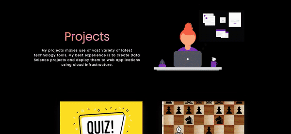

A community maintained open source project aimed at making personal portfolio for researchers, developers and analysts simple, fast and less cumbersome. We make sure you have a full fledged website to showcase your work while you can spend time on your learning and innovative endeavours.

## A sneek peek into what we have here🙈 :

### Home Page:

### Experience Page:

### Project Page:

### Research Page:

### Education Page:

## How to use this?🛠

[Check out our awesome Documentation](https://smaranjitghose.github.io/awesome-portfolio-websites/)

## Contribution Guidelines🏗

Are we missing any of your favorite features, which you think you can add to it❓ We invite you to contribute to this project and improve it further.

Click on the image below to set up and contribute to the project or [Click here](https://github.com/smaranjitghose/awesome-portfolio-websites/blob/master/CONTRIBUTING.md)

## Project Maintainers👨🏫::

|  |  |  |
| :------------------------------------------------------------------------------------------: | :------------------------------------------------------------------------------------------: | :------------------------------------------------------------: |
|                    [Smaranjit Ghose](https://github.com/smaranjitghose)\*                    |                        [Anush Bhatia](https://github.com/anushbhatia)                        |     [Srividya Inampudi](https://github.com/sriinampudi)\*      |

\*\* Open Source Day 2021

## Our valuable Contributors👩‍💻👨‍💻 :

## Open Source Programs we have been a part of:

